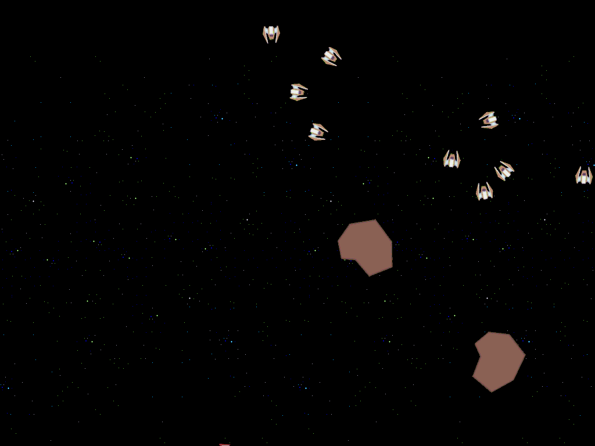

# Spazy & KingPin



Spazy is a small 2D game similar to the oldschool Asteroids game.
It is built with the included custom made KingPin game engine.

This is a project for myself that I started with the intention to learn C++ and 
object oriented programming in general. Maybe I will continue working on it some
day... 

There is a lot of material on the web, but special thanks to [https://www.youtube.com/user/makinggameswithben] and [https://www.youtube.com/user/TheChernoProject].

The UI is created with IMGUI [https://github.com/ocornut/imgui].


## Dependencies

KingPin have a number of external dependecies. The necessary header files for **GL**, 
**GLFW**, **glm** and **SDL** are included in dep/include. However, one must 
also install these libraries: GLU, GL, glut, SDL2, glfw3, GLEW.

KingPin implements sounds with Fmod.

## Installation and running

The hardest part will probably be to link all the external dependencies, which
I won't describe how to do.
After all of those are installed and properly linked in the Makefile, simply type
```
make
```
to compile and 
```
./main
```
to run.


### Author

Joel Oredsson, joel_ored@hotmail.com

